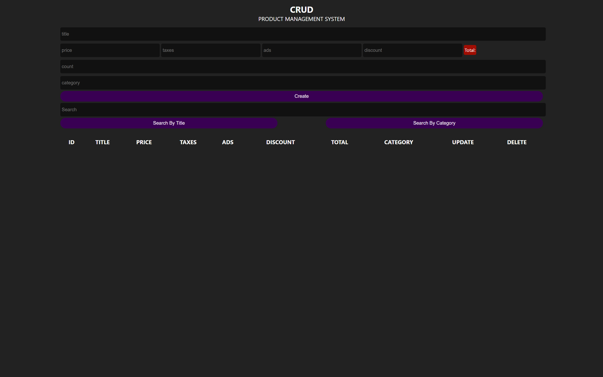

# Product Management System (PMS)

A web-based Product Management System built using HTML, CSS, and Javascript 

This Project allows users to create, manage, update, search, and delete products through a simple and interactive interface while storing data locally using the browser's Local Storage.

---

## Features

- Create new products
- Read and display products 
- Update existing products
- Delete individual products
- Delete all products
- Search by product title 
- Search by category
- Automatic total price calculation
- Local Storage support 
- Clean and user-friendly interface

---

## Technologies Used

- HTML5
- CSS3
- JavaScript (Vanilla JS)
- Local Storage API

---

## CRUD Operations

### Create
Add new Products with:

- Title
- Price 
- Taxes
- Ads
- Discount
- Category

### Read 
Display all stored products in a table.

### Update
Modify existing product information.

### Delete
Remove a specific product or clear all products.

---

## Price Formula 

~~~text
Total = Price + Taxes + Ads - Discount
~~~
The total value updates dynamically while typing.

## Search Functionality

Users can search products by:
- Product Title
- Product Category

## Screen Shots

## Learning Outcomes

Through this project I practiced:
- DOM Manipulation
- Event Handling
- Arrays & Objects
- Local Storage 
- CRUD Logic
- Dynamic UI Updates
- JavaScript Problem Solving 

## Future Improvement

- Product Images
- Product Category Management
- Data Export (CSV/ Excel)
- Backend Integration
- Authentication System
- Dashboard Analytics